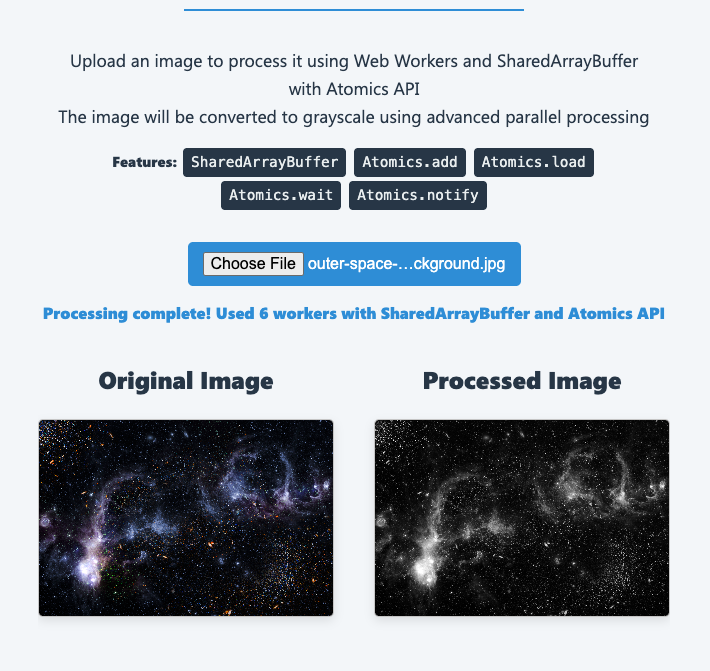

# **Grayscale Image Processor with JS Atomics**



This project demonstrates how to process an image in the browser using **Web Workers** and the **Atomics API** with a **SharedArrayBuffer**. The application applies a grayscale filter to an image, utilizing parallel processing for improved performance and efficient memory handling.

## **Features**
- Processes images in parallel using multiple **Web Workers**.
- Demonstrates the use of **SharedArrayBuffer** for sharing memory between threads.
- Uses the **Atomics API** for thread synchronization and coordination.
- Implements advanced parallel processing patterns like barriers and progress monitoring.
- Displays the original image and the processed grayscale image side-by-side in a clean, centered layout.
- Shows real-time progress of each worker and overall processing.

---

## **Why This Project?**
This project is a practical example of modern web development techniques that leverage multithreading in JavaScript. By utilizing **SharedArrayBuffer** and **Atomics**, it showcases:
1. **Efficient Parallel Processing**:
   - Web Workers process different chunks of the image simultaneously, reducing processing time.
2. **Memory Optimization**:
   - Shared memory (via `SharedArrayBuffer`) eliminates the need to copy data between threads.
3. **Thread-Safe Synchronization**:
   - The `Atomics` API ensures thread-safe operations across workers without race conditions.

This approach is particularly useful for computationally intensive tasks like image manipulation, video processing, or simulations that can benefit from parallel execution.

---

## **Setup Instructions**

### **1. Clone the Repository**
```bash
git clone https://github.com/erickwendel/grayscale-image-processor-workers-atomics.git
cd grayscale-image-processor-workers-atomics
```

### **2. Install Dependencies**
Ensure you have Node.js installed, then run:
```bash
npm install
```

### **3. Start the Application**
This project uses **browser-sync** to serve the files and enable the required headers for `SharedArrayBuffer`.

To start the application:
```bash
npm start
```

This will:
- Serve the app at `http://localhost:3000`.
- Enable the necessary HTTP headers:
  - `Cross-Origin-Opener-Policy: same-origin`
  - `Cross-Origin-Embedder-Policy: require-corp`

### **4. Open the App**
Visit `http://localhost:3000` in a modern browser (e.g., Chrome, Edge) that supports `SharedArrayBuffer` and the required security policies.

---
## **How It Works**

```
+-----------------------------------------------------+
|                     Main Thread                     |
+---------------------+-----------------------------+-+
                      |                             |
                      | SharedArrayBuffer           |
                      | +-------------------------+ |
                      | | Image Data (RGBA)       | |
                      | +-------------------------+ |
                      |                             |
                      | Control Buffer (Int32Array) |
                      | +-------------------------+ |
                      | | [0]: Completed workers  | | <-+  Atomics.add(control, 0, 1)
                      | | [1]: Notification flag  | | <-+  Atomics.store/notify
                      | | [2]: Barrier counter    | | <-+  Atomics.add/wait
                      | | [8+]: Worker progress   | | <-+  Atomics.store
                      | +-------------------------+ |
                      |                             |
        +-------------v-------------+               |
        |                           |               |
+-------v-------+   +-------v-------+     +-------v-------+
| ImageWorker 0 |   | ImageWorker 1 | ... | ImageWorker N |
+---------------+   +---------------+     +---------------+
| Process Chunk |   | Process Chunk |     | Process Chunk |
|               |   |               |     |               |
+---------------+   +---------------+     +---------------+
        |                   |                     |
        +-------------------+---------------------+
                            |
                    +-------v-------+
                    | ProgressMonitor|
                    +-------+--------+
                            |
                            v
+-----------------------------------------------------+
|                  User Interface                      |
|                                                     |
| +-------------+  +-----------+  +-----------------+ |
| |  Original   |  | Processed |  | Progress Bars   | |
| |   Image     |  |   Image   |  |                 | |
| +-------------+  +-----------+  +-----------------+ |
+-----------------------------------------------------+
```

### Process Flow:

1. **Image Loading**:
   - Users upload an image or a default image is loaded.
   - The image is drawn on a `<canvas>` and pixel data is extracted.

2. **Shared Memory Setup**:
   - A `SharedArrayBuffer` is created for image data (zero-copy between threads).
   - A control buffer is created for thread coordination using Atomics.

3. **Parallel Processing**:
   - The image is divided into chunks, each processed by a separate Web Worker.
   - Workers use barrier synchronization via Atomics to start together.
   - Each worker processes its chunk and updates progress atomically.

4. **Progress Monitoring**:
   - A dedicated monitor worker tracks progress using Atomics.load
   - Updates the UI with real-time progress information

5. **Completion**:
   - Workers mark completion with Atomics.add
   - The last worker notifies main thread with Atomics.notify
   - The processed grayscale image is rendered on the result canvas

---

## **Atomics API Usage in This Project**

This project demonstrates advanced usage of the JavaScript Atomics API to ensure thread-safe operations and efficient coordination between worker threads. Here's a detailed explanation of the specific Atomics functions used and their purpose:

### **1. Atomics.store**
- **Usage in Project**: Used to initialize values in the shared buffer and to update worker progress.
- **How it works**: `Atomics.store(typedArray, index, value)` writes a value to the shared array at the specified index in a way that's visible to all threads.
- **Purpose**: Ensures all worker threads see consistent data when initializing or updating shared values.
- **Example**: `Atomics.store(control, workerIndex, 0)` to initialize worker progress.

### **2. Atomics.load**
- **Usage in Project**: Used to read the current state of worker progress and completion.
- **How it works**: `Atomics.load(typedArray, index)` reads a value from the shared array in a way that respects the ordering of operations across threads.
- **Purpose**: Gets current state information without risk of reading partially-updated values.
- **Example**: `const completed = Atomics.load(control, 0)` to check how many workers have completed.

### **3. Atomics.add**
- **Usage in Project**: Used to increment the completion counter atomically when a worker finishes processing.
- **How it works**: `Atomics.add(typedArray, index, value)` atomically adds a value to an existing value in the array and returns the old value.
- **Purpose**: Thread-safe way to increment counters without race conditions.
- **Example**: `const completedWorkers = Atomics.add(control, 0, 1) + 1` to increment and track completed workers.

### **4. Atomics.notify**
- **Usage in Project**: Used to wake up waiting threads when processing is complete.
- **How it works**: `Atomics.notify(typedArray, index, count)` wakes up threads waiting on the specified index.
- **Purpose**: Efficient thread notification without polling, allowing threads to sleep until needed.
- **Example**: `Atomics.notify(control, 1)` to notify the main thread that processing is complete.

### **5. Atomics.wait** (used in Worker context only)
- **Usage in Project**: Used in workers to implement a barrier pattern, ensuring all workers start processing at approximately the same time.
- **How it works**: `Atomics.wait(typedArray, index, value, timeout)` blocks the thread until the value at the index changes from the expected value.
- **Purpose**: Coordinated thread synchronization without busy waiting.
- **Example**: `Atomics.wait(control, 2, waitingAt, 100)` for barrier synchronization in workers.

### **Shared Memory Structure**
The project uses a carefully designed shared memory layout:
- **Index 0**: Total completed workers counter
- **Index 1**: Main thread notification flag
- **Index 2**: Barrier synchronization counter
- **Index 3-7**: Reserved for future use
- **Index 8+**: Individual worker progress (one slot per worker)

### **Benefits of Using Atomics**
1. **Zero-Copy Processing**: Workers operate directly on shared memory without data duplication.
2. **Lock-Free Synchronization**: Avoids traditional locks while maintaining thread safety.
3. **Efficient Coordination**: Workers can coordinate with minimal overhead.
4. **Progress Monitoring**: Thread-safe tracking of individual and overall progress.
5. **Barrier Synchronization**: Ensures workers start processing in a coordinated way.

---

## **Technologies Used**
- **JavaScript**: For client-side logic and multithreading with Web Workers.
- **Web Workers API**: For creating and managing background threads.
- **Atomics API**: For thread-safe operations and synchronization between workers.
  - `Atomics.store`: For writing values visible to all threads
  - `Atomics.load`: For reading values with memory ordering guarantees
  - `Atomics.add`: For atomic counter incrementation
  - `Atomics.notify`: For waking waiting threads
  - `Atomics.wait`: For thread blocking until notification (in worker contexts)
- **SharedArrayBuffer**: For efficient zero-copy shared memory between threads.
- **Canvas API**: For image manipulation and display.
- **browser-sync**: To serve the app with proper security headers required for SharedArrayBuffer.

---

## **NPM Scripts**
- **`npm start`**: Starts the app using browser-sync with headers enabled.

---

## **Architecture and Design**

This project follows a clean architecture with a focus on the Single Responsibility Principle:

1. **Components Layer**:
   - `Controller`: Handles user input and orchestrates the application flow
   - `View`: Manages canvas rendering and image display
   - `ProgressView`: Handles progress UI updates and visualization

2. **Services Layer**:
   - `ImageProcessor`: Coordinates the image processing workflow
   - `WorkerCoordinator`: Manages worker creation, coordination, and termination

3. **Workers Layer**:
   - `imageWorker.js`: Processes image chunks with thread-safe operations
   - `progressMonitorWorker.js`: Monitors and reports worker progress

This separation of concerns allows for better maintainability and extensibility of the codebase.

## **Performance Considerations**

The project implements several optimizations for performance:

1. **Parallelism**: Distributes work across multiple workers based on CPU core count
2. **Zero-Copy Architecture**: Uses SharedArrayBuffer to avoid costly data transfers between threads
3. **Canvas Optimization**: Sets `willReadFrequently` for canvas contexts when reading pixel data
4. **Atomic Operations**: Uses lock-free synchronization for minimal overhead
5. **Barrier Synchronization**: Ensures workers start simultaneously for maximum parallelism
6. **Chunk-Based Processing**: Each worker processes only its assigned chunk, reducing memory pressure

## **Example Usage**

1. Start the app:
   ```bash
   npm start
   ```
2. Upload an image or view the default image.
3. Watch as the grayscale filter is applied in real-time using parallel processing.
4. Observe the individual worker progress bars showing the processing status.

---

## **Browser Compatibility**
This project requires a browser that supports:
- **SharedArrayBuffer** and **Atomics API**
- Proper security policies (required for SharedArrayBuffer access):
  - `Cross-Origin-Opener-Policy: same-origin`
  - `Cross-Origin-Embedder-Policy: require-corp`

### **Security Requirements**
Due to speculative execution attacks like Spectre, browsers require these security headers to be present for SharedArrayBuffer usage. The application uses browser-sync to automatically set these headers.

### **Why These Headers?**
- **Cross-Origin-Opener-Policy: same-origin**: Ensures the page can only share its browsing context group with same-origin pages.
- **Cross-Origin-Embedder-Policy: require-corp**: Ensures all resources loaded by the page explicitly allow being loaded.

These security measures prevent potential data leakage through timing attacks on shared memory.

### **Recommended Browsers**
- Google Chrome (version 92+)
- Firefox (version 89+)
- Edge (version 92+)
- Safari (version 15.2+)
